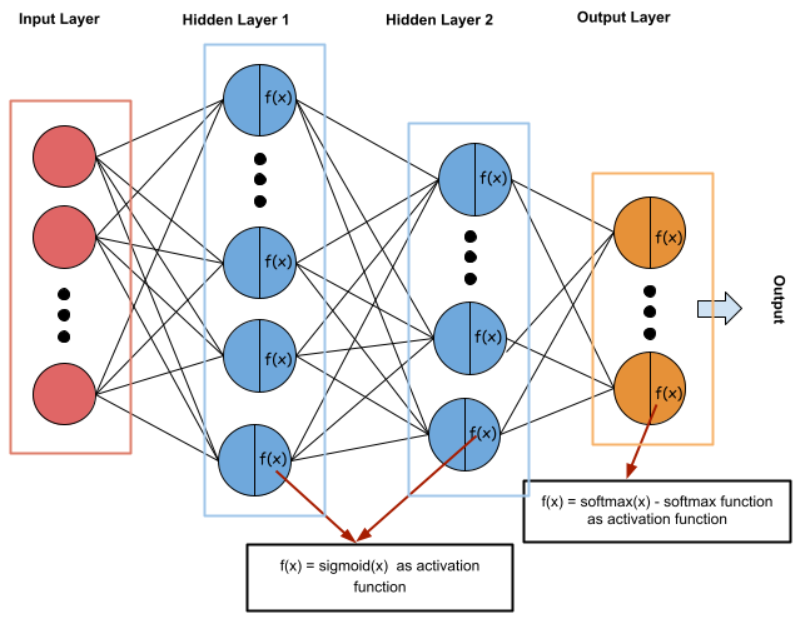

# Digit Classifier - Neural Net

## Overview
For this project I created the `hello world` of neural networks - an AI that can classify handwritten numbers. This project was done for a homework assignment in my Foundations of Artificial Intelligence course.

## Restrictions
For this project I was not allowed to use any sort of machine learning library such as TensorFlow or PyTorch. Numerical libraries such as NumPy were allowed.

## Dataset
http://yann.lecun.com/exdb/mnist/

## Program Specifics
The neural network that I implemented for this project consists of an input layer, 2 hidden layers, and an output layer. The hidden layers use the sigmoid function as an activation function, and the output latyer uses the softmax function.

  

## Results
The neural net has an accuracy of approximately 95% on the mnist dataset. On a dataset the neural net has never seen before, it has an accuracy of approximately 70%.
